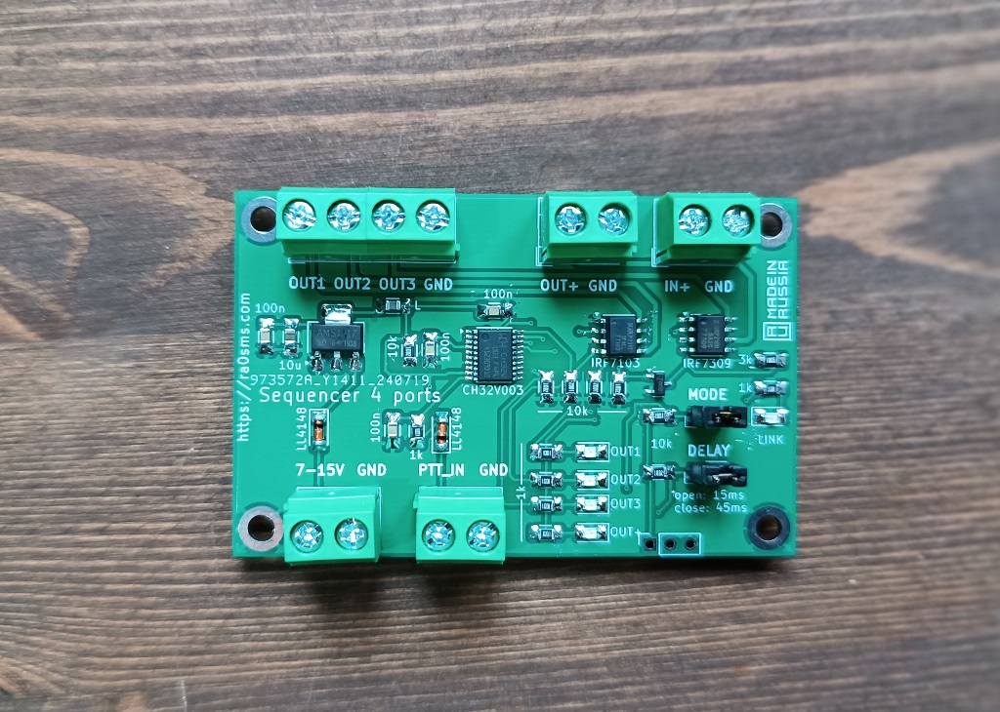

# Sequencer

More information - https://ra0sms.com/sequencer-2/

It works in two modes:

1. PA BIAS mode (`MODE` jumper is opened)

   

2. LNA mode (`MODE` jumper is closed)

   

--------------------------------------------------------------
PCB dimension: 70*45mm

Consumption current: 30mA

Switch current: up to 1A

### Schematic

